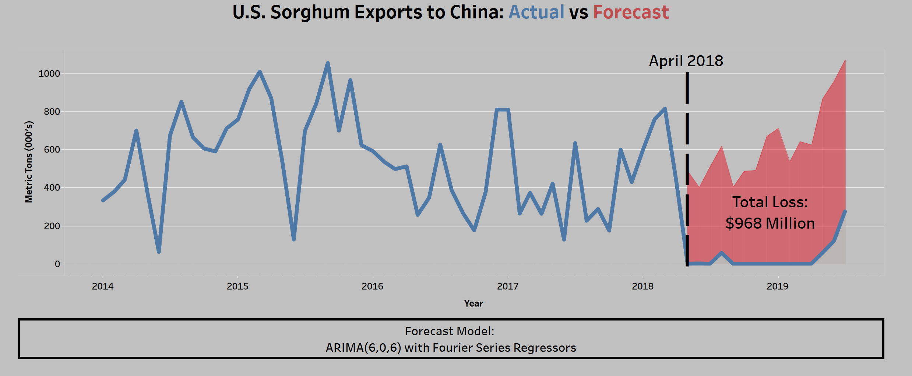

# carolina-data-challenge-2019
"best insight" winner at the 2019 Carolina Data Challenge

---

Myself and three other students from NC State's Master in Analytics program (Supreet Desphpande, Taylor Kooy, and Meghan Weber) won 1st place in the main even "best insight" at the 2019 Carolina Data Challenge. We had 24 hours to explore several datasets and perform an analysis to generate insights about the data provided.

One of the avaliable datasets was data about U.S. agricultural imports and exports. After some research I discovered that one particular product, sorghum, was a crop that the U.S. almost exclusively exported to China in the past, and that trade had dropped to near zero due to the trade war with China that began in early 2018. Given this, if we could forecast what exports should have been, we could roughly approximate the loss due to the trade war.

My teammate posted our winning Tableu presentation to her public profile here:
https://public.tableau.com/profile/meghan.weber2859#!/vizhome/UNCDataChallenge/Story1

Here is our main result from that presentation:

